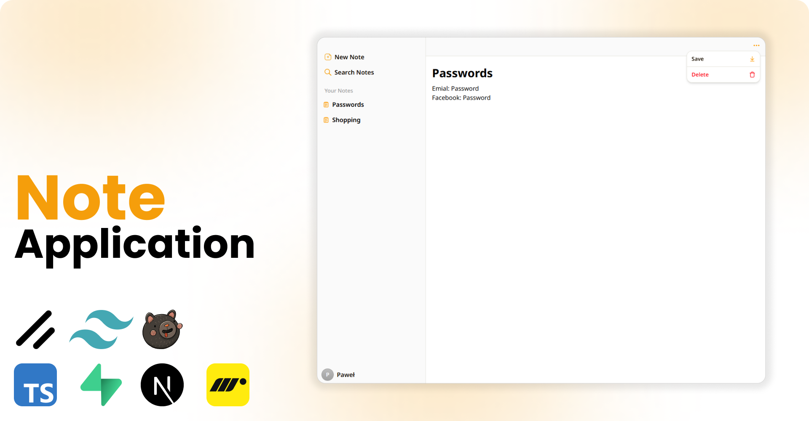

<div align="center">

# NoteAI

Lekka aplikacja Next.js do szybkiego zapisywania pomysłów i synchronizacji notatek poprzez Supabase.



</div>

## Najważniejsze funkcje

- Płynny edytor z animowanym zwijaniem tytułu w oparciu o React 19 i `motion`
- Przechowywanie danych w Supabase z gotową integracją Google OAuth
- Typowane helpery klienckie, store’y Zustand i kompozycyjne komponenty UI
- Elastyczny pasek boczny i moduł wyszukiwania przygotowane na dalszą rozbudowę

## Stos technologiczny

| Warstwa                 | Narzędzia                                  |
| ----------------------- | ------------------------------------------ |
| Frontend                | Next.js 16, React 19, Tailwind 4, Radix UI |
| Uwierzytelnianie i dane | Supabase, Supabase Auth Helpers            |
| Stan i animacje         | Zustand, motion/react                      |

## Szybki start

Zainstaluj zależności i uruchom serwer developerski:

```bash
npm install
npm run dev
```

Po starcie przejdź do [http://localhost:3000](http://localhost:3000).

## Konfiguracja środowiska

1. Utwórz projekt w Supabase i w **Authentication → URL Configuration** ustaw **Site URL** na lokalny lub docelowy adres (np. `http://localhost:3000`).
2. W **Authentication → Providers → Google** włącz Google, wprowadź identyfikator/sekret klienta OAuth i dodaj `https://<your-project-ref>.supabase.co/auth/v1/callback` do dozwolonych URI przekierowań.
3. Utwórz plik `.env.local` i dodaj:

```bash
NEXT_PUBLIC_SUPABASE_URL=https://<your-project-ref>.supabase.co
NEXT_PUBLIC_SUPABASE_ANON_KEY=<anon-key-from-supabase>
NEXT_PUBLIC_SUPABASE_REDIRECT_URL=http://localhost:3000
```

Po zmianie zmiennych środowiskowych ponownie uruchom `npm run dev`.

Po kliknięciu **Log in with Google** na `/login` Supabase przeprowadzi OAuth i przekieruje z powrotem do aplikacji, gdzie można tworzyć i zapisywać notatki.

## Struktura projektu

```text
app/           # Strony App Routera (home, login, dynamiczne notatki)
components/    # Wspólne komponenty UI (sidebar, wyszukiwarka, menu)
lib/           # Klient Supabase i współdzielone utils
public/        # Statyczne zasoby (m.in. ReadMeImage.png)
store/         # Store’y Zustand dla stanu UI
```

## Przydatne skrypty

- `npm run dev` – uruchomienie lokalnego serwera developerskiego
- `npm run build` – zbudowanie wersji produkcyjnej
- `npm start` – uruchomienie builda produkcyjnego lokalnie
- `npm run lint` – analiza kodu ESLintem
